# 项目简介

MatouWebshell 是一个基于 Vue 3 和 Python 开发的, 针对webshell利用的工具平台，目前集成如下工具

- webshell管理工具：基于哥斯拉webshell设计思路开发，去除了一些通信流量的强特征，支持自定义流量格式以此实现伪装正常业务流量，目前仅支持目标系统为Linux，支持jsp/jspx和php
- 后面再开发0.0


# 项目启动

## elf二进制文件

由于项目是使用GLIBC_2.38进行编译，所以建议在如下版本以上的系统上运行：

- Ubuntu 23.10
- Fedora 39 / 40
- Arch Linux
- Debian 13 
- openSUSE Tumbleweed


解压项目至目录，随后给予app.in可执行权限，支持如下启动参数

- --debug：输出调试信息
- --port：指定服务端口

```
./app.bin --debug --port 6324
```

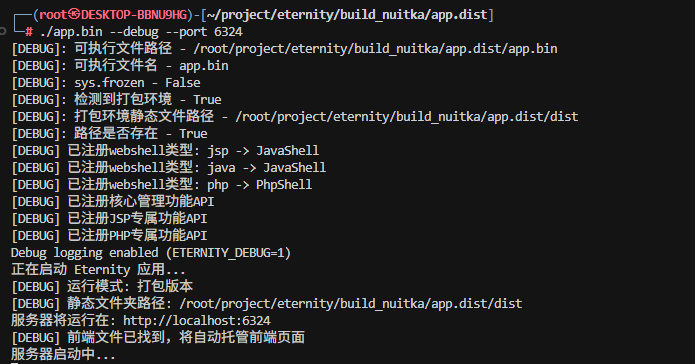	


然后浏览器访问`http://localhost:6324/`

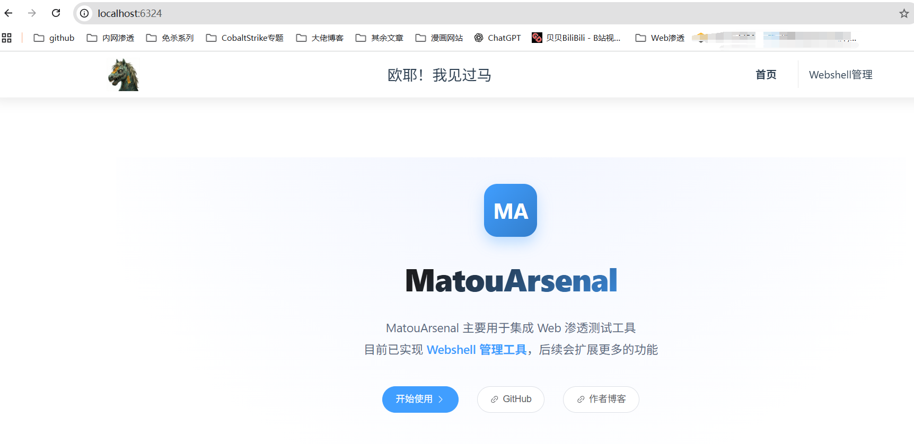	


## docker镜像

拉取docker镜像

```
docker pull henry404/matouwebshell:1.0
```


运行docker容器

```
docker run -it --rm -p 5001:5001  -v matou_data:/app/router_modules/webshellmanager_router/data henry404/matouwebshell
```


# Webshell管理

## Webshell生成

### 基础配置

生成webshell的基础配置参数如下：

- 参数名：在初始化阶段，客户端需将加密的payload以form格式发送至webshell服务端，post请求参数如：`{参数名}={encryptedPayload}`
- webshell类型：支持php、jsp和jspx
- CookieName：你可以理解成webshell的密钥，用于激活webshell功能的开关
- 标识符替换功能：替换指定前缀的变量标识符，支持“随机生成”和“变量池文件”（变量池文件为位于`router_modules/webshellmanager_router/webshell`目录，用户可自行修改变量池文件的标识符）

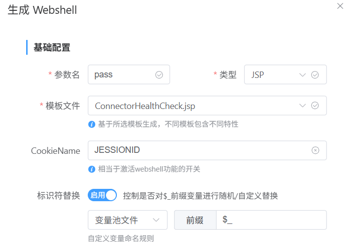	


### 高级选项

不同webshell类型对应的高级选项功能也不一样。

在php类型立，有个模拟正常业务功能，启用后可选择对应的业务模板（会将基础配置的payload嵌入到业务模板中）

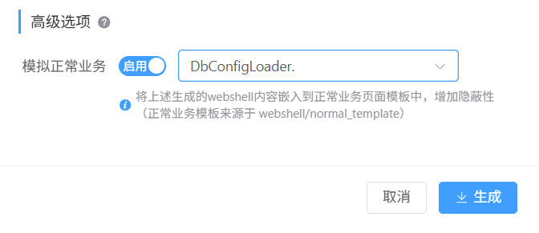	

jsp和jspx类型都支持关键字混淆功能，jsp仅支持Unicode编码混淆，而jspx则支持Unicode编码、CDATA拆分、HTML实体编码、HTML+Unicode编码、CDATA+Unicode编码和CDATA+HTML编码

比如这里演示对关键字`getAttribute`进行CDATA+Unicode编码混淆，下方可选择Unicode编码的比率

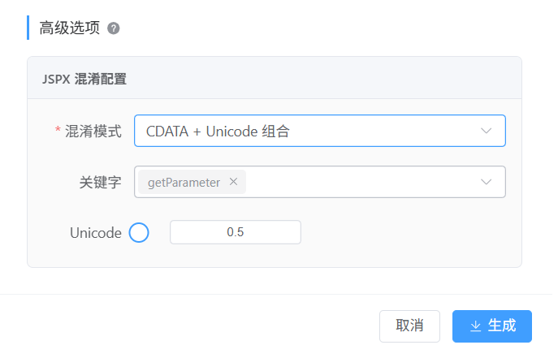		


混淆后的关键字代码如下所示

```
 if (session.g<![CDATA[\u0065]]><![CDATA[\u0074\u0041\u0074t\u0072i\u0062]]><![CDATA[\u0075t\u0065]]>("$payload$") == null
```

​	

## Webshell连接

### 基本参数

点击添加Webshell按钮，填写Webshell的基本参数，此处的连接密码与其他webshell不一样，仅用于加密通信流量，所以说该连接密码是可以变化的，其次Cookie名称才是激活webshell功能的开关

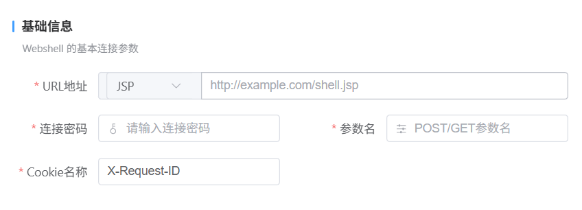

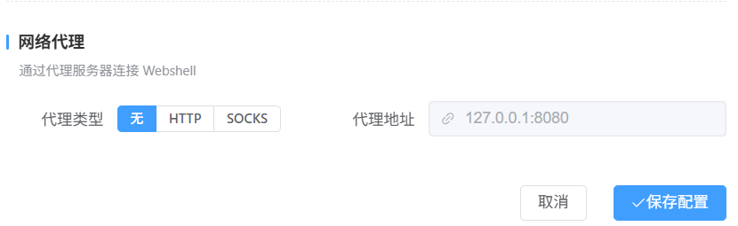	

### 传输与加密

用户可以自定义数据通信的加密类型、请求格式和响应格式, 例如下面选择加密类型为aes_base64，请求格式为form，响应格式为json（当选择该格式时会弹出“JSON响应模板”，“PAYLOAD_DATA”则作为加密数据的占位符）

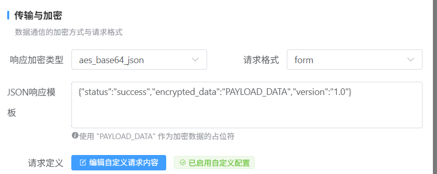	


支持用户自定义请求内容，目前支持form、plain，json/xml以及png格式，可通过配置json内容来修改请求格式

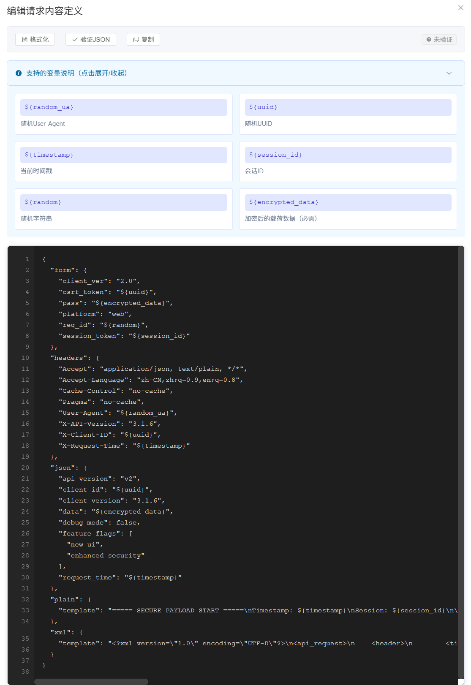


如下演示请求格式为xml，响应格式为json

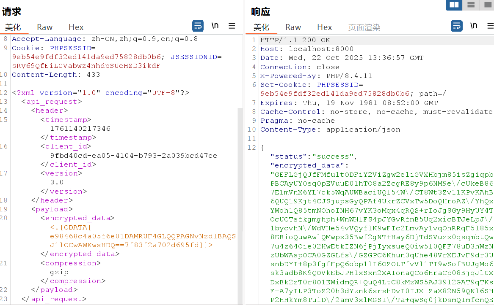

​	

如下演示请求格式为form，响应格式为png

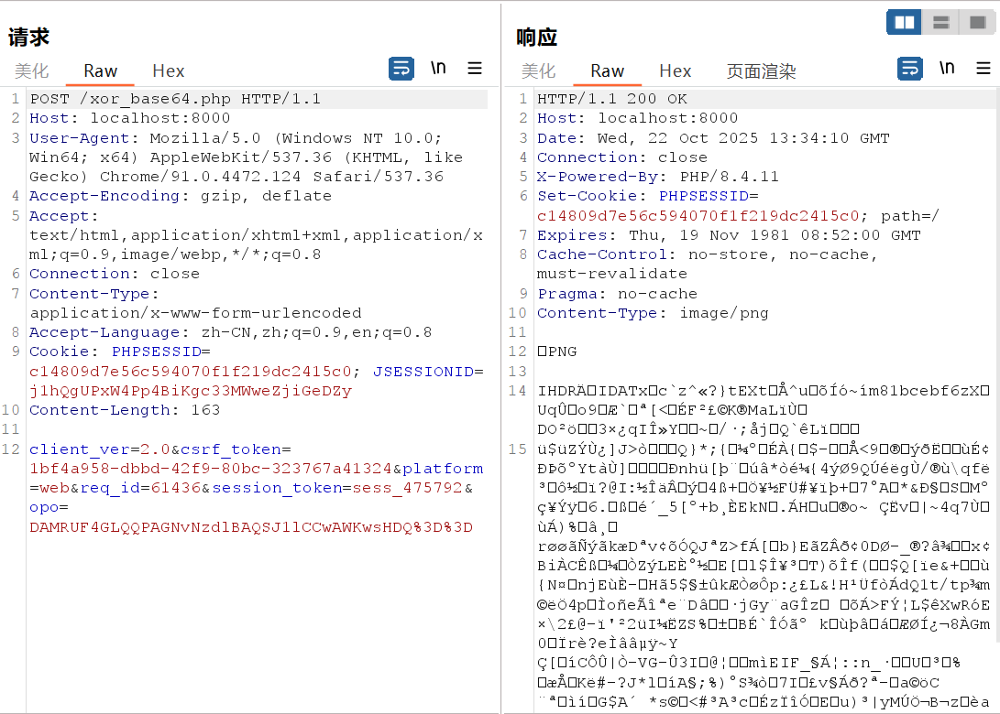	


## 命令行终端

终端支持cd命令切换目录，切换后的目录会自动同步到文件管理器

支持历史记录导航，可按键盘上下箭头查看历史命令

点击清空按钮可清空终端输出

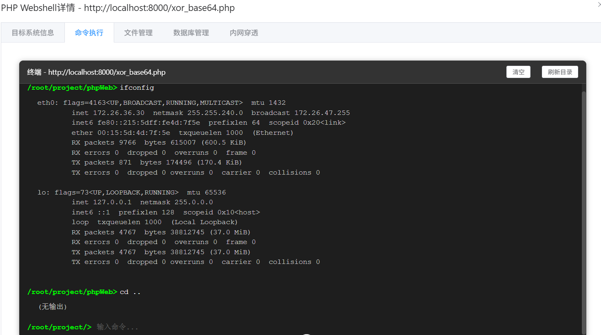		


## 文件管理

文件管理器分为三个区域：

- **左侧**：目录树，显示文件夹结构
- **中间**：文件列表，显示当前目录的文件和文件夹
- **顶部**：地址栏和操作按钮

浏览目录的文件有三种方式：

- 在左侧目录树中点击文件夹
- 在文件列表中双击文件夹进入
- 直接在地址栏输入路径，按 Enter 跳转

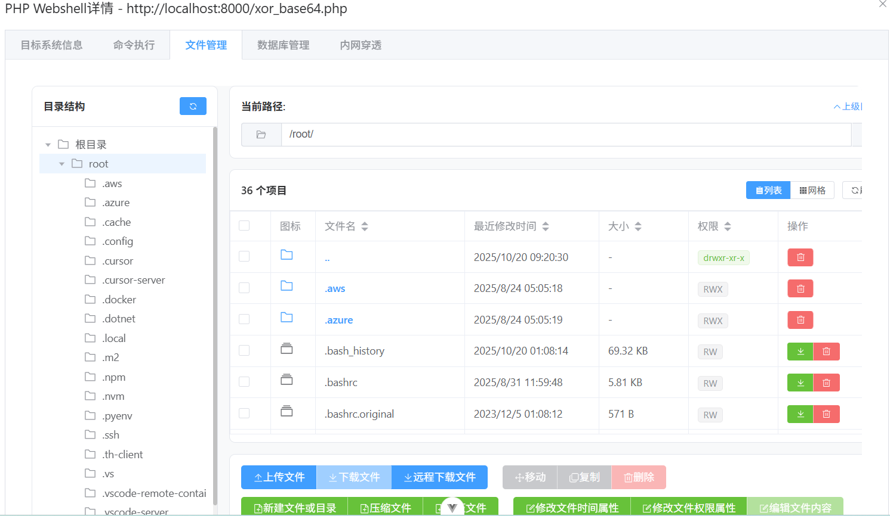


### 上传和下载

文件的上传和下载有普通模式和大文件模式，大文件会使用分块传输机制

在全局设置里，支持用户设置大文件传输的配置参数，例如分块大小以及请求间隔等

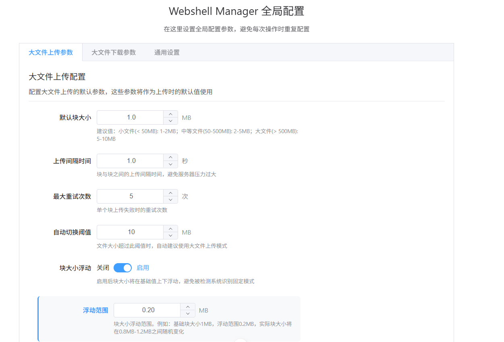	


### 编辑文件

双击文本文件（或选择后点击 **"编辑"**），在编辑器中修改内容，然后点击 **"保存"** 按钮保存修改

文件大小不能超过1MB，且不支持编辑二进制文件

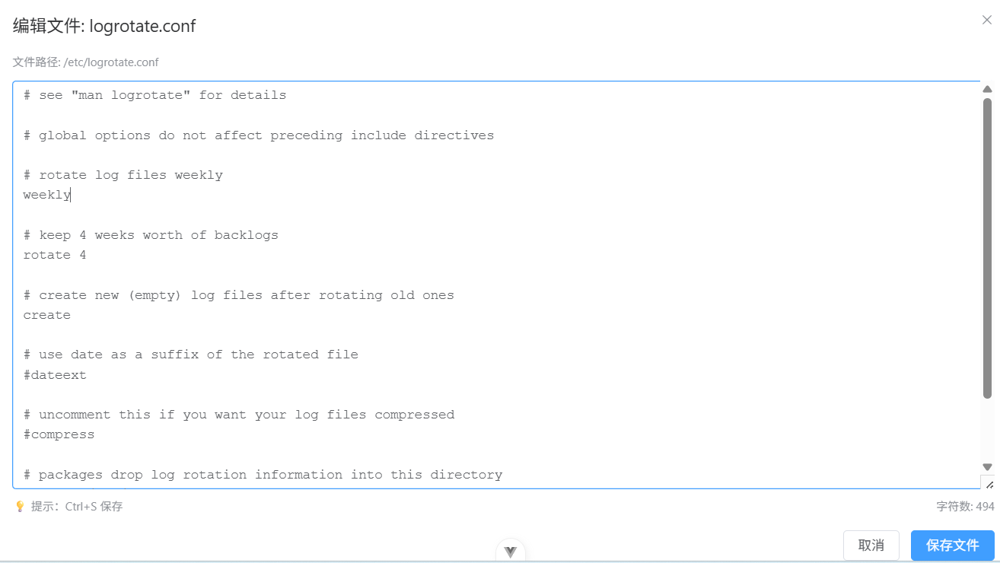	


### 压缩和解压

勾选要压缩的文件/文件夹，然后点击 **"压缩"** 按钮，输入压缩后的文件路径

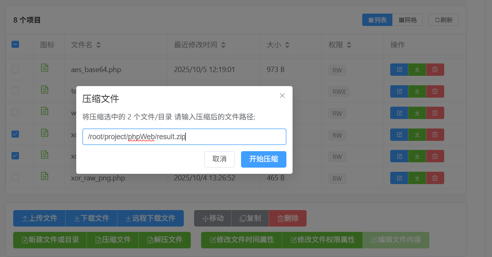


选择 ZIP 文件点击 **"解压"** 按钮，设置解压目录参数

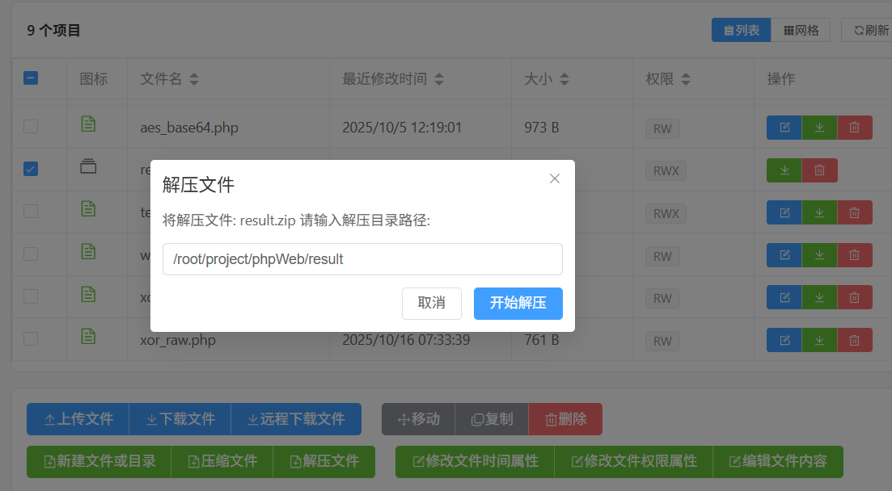


### 修改文件权限

支持修改文件的权限属性和时间属性（时间属性只能修改“修改时间”和“访问时间”）

​	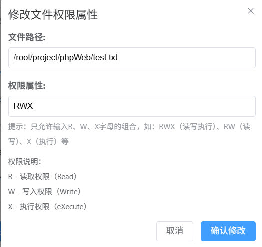

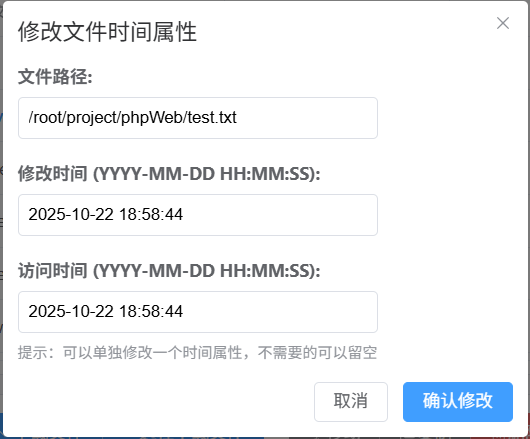	


## 数据库管理

输入数据库配置参数，点击**连接测试**按钮尝试连接数据库，在SQL查询区域可执行SQL语句，点击左侧数据库的表节点会自动在SQL查询框生成相应的查询语句，查询结果会显示在下方区域

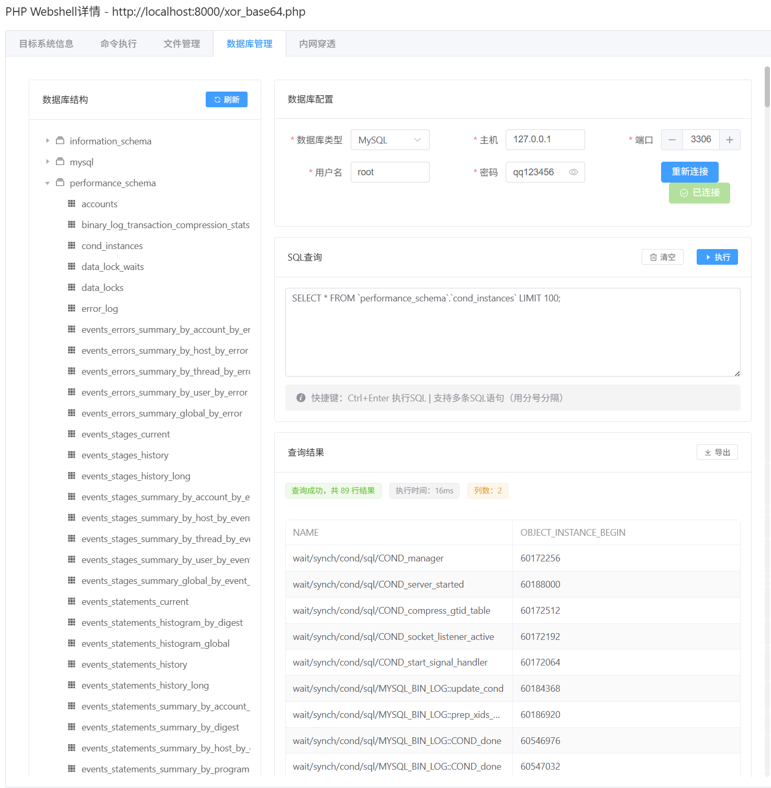


## 内网穿透

内网穿透功能允许你通过已控制的 Webshell 服务器访问其内网资源，支持三种模式

- **SOCKS代理**：在本地开启一个SOCKS代理端口，然后将浏览器或扫描器等任何支持SOCKS协议的工具指向该端口，就可以自由访问webshell内网中任意的IP和端口。支持内网白名单ip功能，启用后仅与白名单IP建立隧道
- **端口映射**：将内网端口映射到本地，例如将内网的3306端口映射至本地，再使用本地工具进行连接
- **反向 DMZ（只支持jsp）**：反向代理内网服务，适用于反弹shell

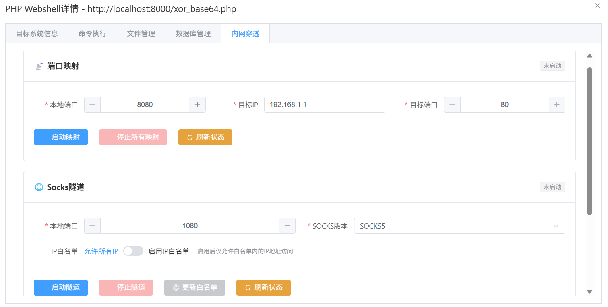

​	

## 内存马注入(jsp)

### 加载内存马

填写内存马相关配置信息，这里Cookie名称相当于内存马的密钥，若请求的cookie值不正确，那么内存马路径返回正常页面

内存马加载成功后下方会显示相关的配置信息，并保存到历史记录里

目前支持以下内存马类型：

- **Servlet 内存马**：注册为 Servlet 组件
- **Filter 内存马**：注册为 Filter 组件

​	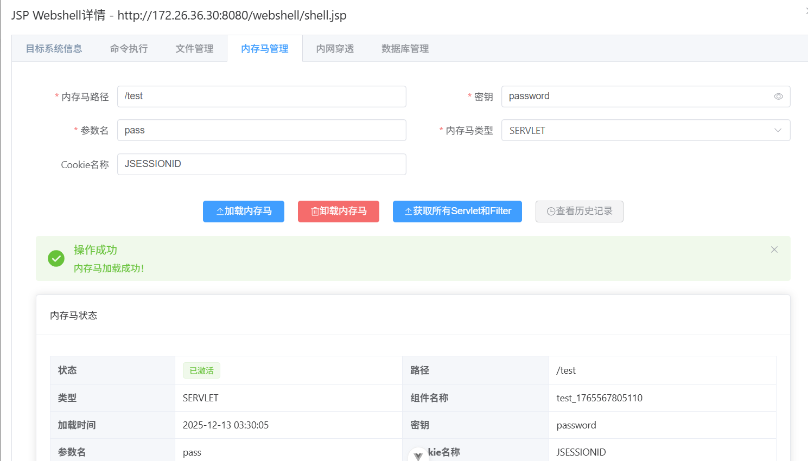


​		

### 获取注册组件信息

查看当前Web应用的所有Servlet映射配置信息

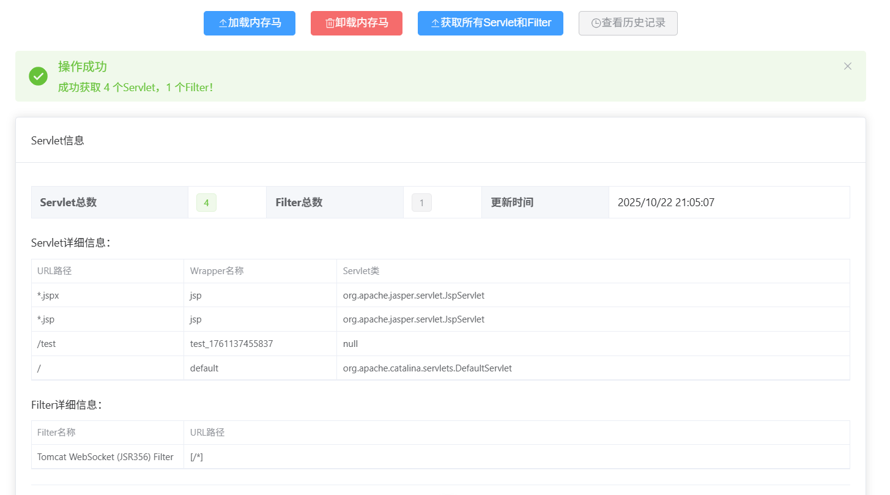


​	

### 卸载内存马

选择要卸载的内存马类型，然后填写内存马路径以及Wrapper名称或者Filter名称

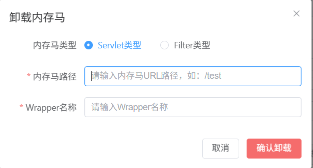	


# 更新日志

若有bug、功能上的建议等请反馈至issue，主打一个听劝

**Todo.....**


# 可能遇到的问题

### javac没有权限

因为项目内置了一个javac用于编译java类文件，所以需要给javac可执行权限

```
chmod +x router_modules\webshellmanager_router\java\payload\jdk\bin\javac
```

